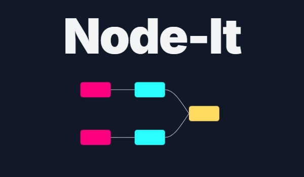
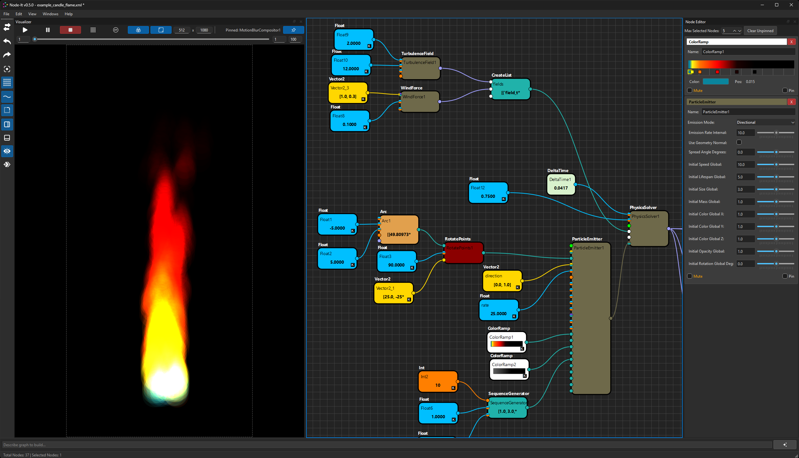

# Node-It: Visual Scripting Made Easy! 💡

  

Node-It is a versatile visual scripting application built with Python and PySide6, offering a graphical environment to design, create, and execute various logic flows and data processing pipelines. It's perfect for tasks ranging from generative art and data manipulation to AI interaction and animation control.

**📺 Check out our Official YouTube Channel for Demos & Tutorials:**
[**youtube.com/@Node-It**](https://www.youtube.com/@Node-It)

---

## Key Features

*   ✨ **Intuitive Node Graph Interface:** Drag-and-drop creation and connection.
*   🎨 **Extensive Node Library:** Built-in nodes for diverse tasks.
*   🔄 **Dynamic & Extensible:** Dynamic ports and an architecture designed for adding new custom nodes.
*   🎬 **2D Visualizer & Animation:** Integrated canvas viewer with animation controls and keyframing.
*   🤖 **Experimental AI Graph Builder:** Describe graphs with natural language (requires Google Gemini API).
*   💾 **Save & Load:** Graphs are saved in XML format.
*   🔧 **Developer Friendly:** Open-source (MIT License for the software itself) and built with Python & PySide6.

---

## Current Status & Access

Node-It is currently in **Beta (v0.6.0)** and developed by **Vinman75**.

**Access to the Node-It software and its source code is currently by invitation only.**

We are looking for enthusiastic testers, users with interesting project ideas, and potential contributors.

✉️ **How to Request Access or Inquire About Contributions:**
Please send an email to: **node.it.software@gmail.com**

In your email, please include:
*   Your GitHub username (if you have one).
*   A brief description of your interest in Node-It (e.g., what you'd like to use it for, your experience with visual scripting, or how you'd like to contribute).

I appreciate your interest and will get back to you as soon as possible!

---

## 📚 Full Documentation

For detailed guides, tutorials, and API references, please visit our full documentation website:

➡️ **[https://your-username.github.io/node-it-info/](https://vinman75.github.io/node-it-info/)** ⬅️

---

## Screenshots (Examples)

  

---

We're excited to build a community around Node-It and see what you create!

#NodeIt #VisualScripting #Python #PySide6 #NodeBased #CreativeCoding #SoftwareDevelopment #BetaSoftware #InviteOnly
